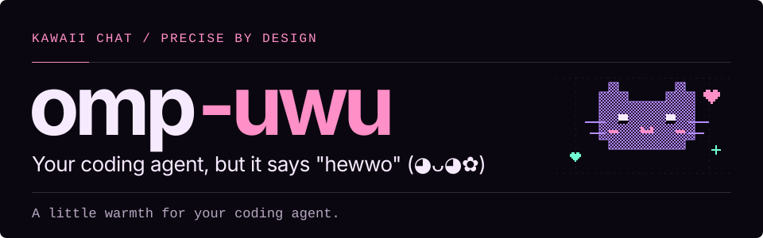
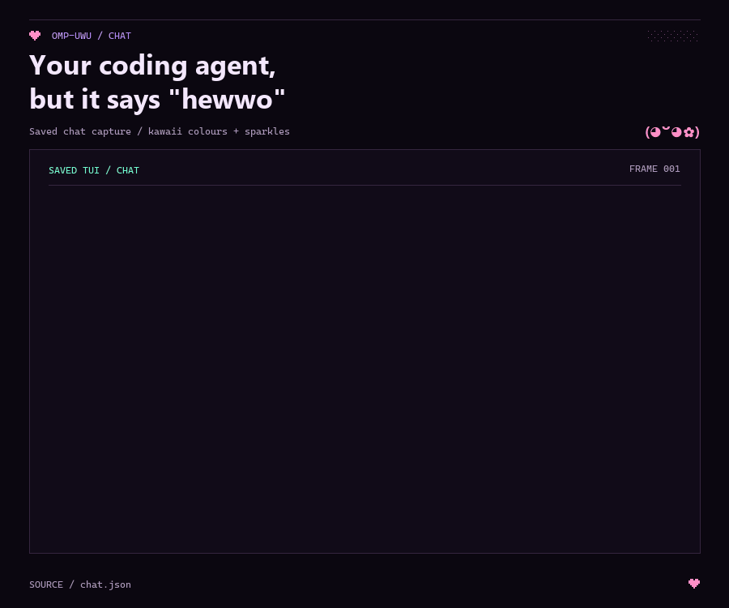
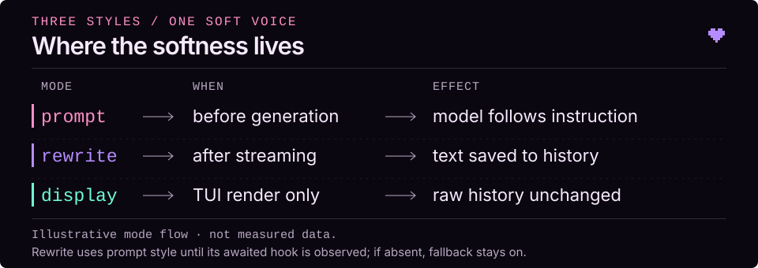
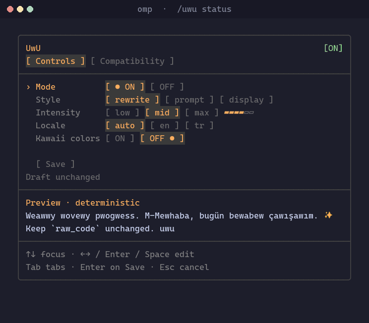
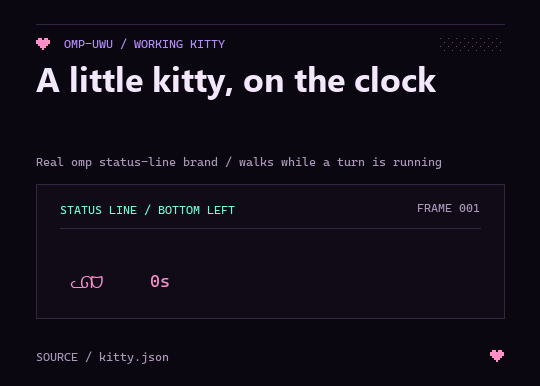
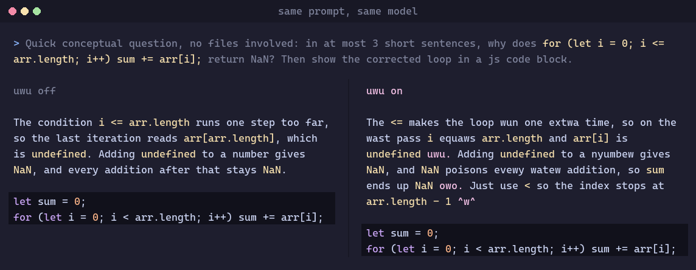
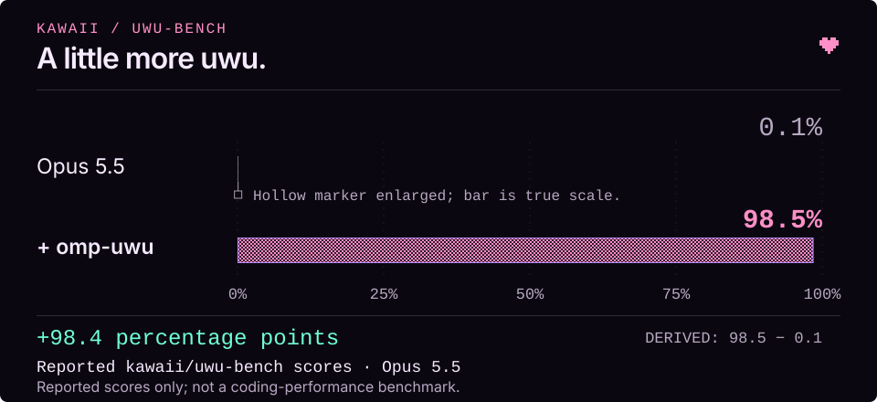

# omp-uwu

**Your coding agent, but it says "hewwo" (◕ᴗ◕✿)**



Long coding sessions can feel a little grey. omp-uwu is an [omp](https://github.com/can1357/oh-my-pi) extension that adds playful uwu-speak, kaomoji and optional pastel colors to your agent's chat. A little warmth around the work, not inside your code. ♡

[Quick start](#quick-start) · [Styles](#choose-your-style) · [Commands](#command-reference) · [Reported scores](#reported-kawaii-scores) · [Contributing](#contributing)

## Quick start

```sh
omp plugin install omp-uwu
```

Restart omp. On a fresh install, the defaults are:

| uwu | Style | Level | Locale | Colors |
|---|---|---|---|---|
| **on** | **rewrite** | **mid** | **auto** | **off** |

Settings persist in `~/.omp/agent/omp-uwu.json` (or the active agent directory when overridden). Open `/uwu status` to adjust them, or try `/uwu colors on` for the pastel palette. Existing saved settings take precedence over the defaults.

### A real TUI, a softer voice



This GIF shows **omp's real TUI components**, captured without a model call: `/uwu colors on` over the `dark-sunset` theme. The pastel editorial frame is presentation artwork, not additional app UI. The prose is uwufied; inline code, numbers and the corrected loop remain exact in this example. [How the demos are made](#demo-assets).

## Choose your style

| Style | Where styling happens | History and model context |
|---|---|---|
| **rewrite** · default | Deterministically, after the reply finishes streaming | Styled text enters history and context once the awaited hook is supported |
| **prompt** | The model follows a system-prompt instruction while streaming | Model-written uwu text; results depend on the model |
| **display** · experimental | Only while the ANSI TUI draws prose | Original text stays in history; no uwu instruction goes to the model |



**Rewrite starts with a prompt fallback.** The first turn uses prompt style until omp demonstrates support for the awaited `assistant_message` hook. If that hook never arrives—for example on omp **18.4.3**—prompt style remains the fallback. Once supported, rewriting needs no extra style-prompt tokens; code/tool blocks and metadata are untouched. The TUI refreshes after streaming finishes, but clients that render only streamed chunks may continue showing the original text.

Selecting any style also **turns uwu on**. Level and locale apply to all three:

- **`min`:** keeps prose unchanged and only adds occasional `uwu`, `owo`, kaomoji or emoji at sentence ends. Code and other protected spans stay exact. Prompt style requests this behavior from the model; rewrite is deterministic.
- **`low` / `mid` / `max`:** fewer changes and decorations / original strength / stronger styling.
- **`auto`:** protects both English and Turkish critical words. It does **not** detect the language.
- **`en`:** protects English critical words only.
- **`tr`:** adds Turkish forms on top of English protection. Locale never translates replies.

Negations, warnings and common Turkish inflections are protected conservatively, not by a full linguistic parser.

## Command reference

Commands stay plain, even when the conversation gets fluffy.

| Command | What it does |
|---|---|
| `/uwu` | Open the TUI settings dashboard (plain summary outside the TUI); does not toggle |
| `/uwu on` · `/uwu off` | Turn it on or off explicitly |
| `/uwu rewrite` | Rewrite finished replies deterministically (default, with the fallback above) |
| `/uwu prompt` | Ask the model to write in uwu while it streams |
| `/uwu display` | **Experimental:** style prose only on screen, in the ANSI TUI |
| `/uwu level min\|low\|mid\|max` | Decorations only, light, standard or strong intensity |
| `/uwu locale auto\|en\|tr` | Which critical words to protect (never translates) |
| `/uwu colors [on\|off]` | Kawaii palette, sparkles and animated working cat (toggles without an argument) |
| `/uwu preview <text>` | Show a sample with current settings, without changing anything |
| `/uwu status` | Open the dashboard (plain one-line summary outside the TUI) |

In prompt style, `/uwu preview` is a **deterministic approximation**, not a prediction of the model's reply.

### Your little control panel



- **Controls:** switches, style/level/locale chips, a level meter and a live sample.
- **Compatibility:** what omp has actually shown it supports in this session—rewrite hook, display hook and fallbacks. These are observations, not guarantees.
- **↑/↓** moves focus; **←/→** or **Enter/Space** changes a value; **Tab** switches tabs.
- **Enter on Save** applies the draft. **Esc** discards it. Moving around or editing the preview never saves settings or changes existing messages.
- **Reset to defaults (Enter/Space)** resets only the draft: on, rewrite, mid, auto, colors off. Choose **Save** to persist it, or **Esc** to keep the previous settings.
- Command completion lists actions and supported values. Invalid actions explain the rejection; confirmations point back to `/uwu status`.
- Action labels and keyboard guidance use the normal text color; focus and selected values also have cursor/bracket markers, not color alone.

### Pastels & sparkles ♡

`/uwu colors on` applies a pastel palette to chat Markdown and the user-message bubble. Whenever uwu is on, a `(◕ᴗ◕✿) uwu` status badge identifies it independently of colors. In chat prose, `uwu`/`owo` get per-letter rainbows; kaomoji such as `(◕ᴗ◕✿)` and `(ﾉ◕ヮ◕)ﾉ`, and glyphs like `♡ ☆ ✧ ✿`, get a pastel tint.

While uwu mode and colors are on, a full-body kitty walks back and forth instead of the ANSI TUI's activity spinner: `ᓚᘏᗢ` → `ᗢᘏᓗ`, with alternating legs and tail poses. Its seven-column lane keeps the turn timer and loader text steady. The same kitty appears with every symbol preset (`unicode`, `nerd`, and `ascii`); compact running-tool icons and other preset symbols stay unchanged. `/uwu colors off` or `/uwu off` restores your original spinner. Native/client spinners are unchanged.



Enable **both** switches, then send a message:

```text
/uwu on
/uwu colors on
```

Look **bottom-left, beside the elapsed turn timer** while omp is working. The GIF shows two cycles of the real status-line brand segment, sampled without a model call; the surrounding frame is presentation artwork.

Everything is colored **at render time, in the ANSI TUI only**:

- No ANSI codes enter message text or history. Code, code blocks and link targets are never painted.
- The palette is an in-memory TUI theme; other components sharing those colors may change too. It pauses omp's automatic theme detection until omp restarts.
- An existing host transform, such as live-voice transcript coloring, takes precedence.
- Other clients and plain output are not colorized.

## What changes—and what stays exact

**Rewrite and display** target natural-language chat prose. Their deterministic protection rules leave recognized fenced/inline code, URLs, paths, numbers, quoted spans, identifiers, config keys and critical words byte-for-byte unchanged. These are syntax-aware rules, not a guarantee that every possible prose token or safety-sensitive phrase is recognized; display also has run-boundary limits described below.

Tool-call arguments, file contents written or edited through tools, subagent prompts/messages and tool blocks are outside these transforms. Commit messages are not a styling target. In **prompt style**, including rewrite's first-turn or unavailable-hook fallback, keeping code, commands, quoted errors, files and commit messages exact is an instruction to the model—not a byte-preservation guarantee from the plugin.

The playful bits include `r`/`l` → `w`, occasional `th` → `d`, `na/ne/no` → `nya/nye/nyo`, occasional stutter, rotating kaomoji and the odd cute emoji (`✨ 💖 🌸 🎀`). Examples include `٩(◕‿◕｡)۶`, `(ฅ^•ﻌ•^ฅ)` and `(づ｡◕‿‿◕｡)づ`, with examples drawn from [kaomoji.you](https://kaomoji.you/). The intent is readable meaning, numbers and warnings—not a safety or coding-quality guarantee.

### Before & after, from real replies



These are **real, unedited replies** from `anthropic/claude-opus-5-5`, using the same prompt and model with the extension off and on, rendered as images. Both code blocks in this example are identical byte for byte. See the [prompt](demo/prompt.txt), [plain transcript](demo/plain.txt) and [uwu transcript](demo/uwu.txt). This is an example, not a coding benchmark.

## Reported kawaii scores



| Reported configuration | Kawaii/uwu-bench score |
|---|---:|
| Opus 5.5 | **0.1%** |
| Opus 5.5 + omp-uwu | **98.5%** |
| Derived difference: 98.5 − 0.1 | **+98.4 percentage points** |

**A visualization of two existing reported scores, not a new benchmark run.** The original README reported 0.1% and 98.5%; the difference above is derived from those values. No raw benchmark results, harness, sample size or scoring methodology are checked into this repository, so reproducibility and uncertainty cannot be assessed here.

These are reported **kawaii scores**, not evidence of coding accuracy, speed, cost or safety improvements. The [legacy HTML chart](demo/uwu-bench.html) is a visualization with decorative terminal/config panels, **not raw benchmark data**. The README now uses the static SVG instead.

## Display mode: know the edges

Display mode uses omp's **private per-message text transform**, not public extension API. The plugin finds `AssistantMessageComponent` through the shared `Container` base class. If it cannot, display styling and sparkles do nothing (the palette still works). There is **no silent fallback** to prompt or rewrite. `/uwu status` reports whether the hook was found.

- Styling happens on individual Markdown prose runs before wrapping. Inline formatting, links, newlines and streaming edits split runs, so results can differ from rewrite or `/uwu preview`. Display adds no emoticons or stutters at low/mid/max; min adds only sentence-end decorations.
- Recognized identifiers, numbers and quoted spans within a run stay protected. **Quotes split across runs cannot be protected as a whole.**
- Some paths skip the transform: blockquotes, some tables, headings and math may stay unchanged.
- **Native clients are unsupported:** omp **18.4.4** sends them raw Markdown. RPC, print and export also retain original text.
- Changing display, level, locale or on/off refreshes messages already on screen, with or without colors.

## Install options

```sh
omp plugin install omp-uwu          # from npm (recommended)
omp plugin install omp-uwu@0.8.0    # pin a version
omp plugin uninstall omp-uwu        # remove
```

If you previously copied a loose `uwu.ts` into `~/.omp/agent/extensions/`, delete it after installing the plugin. Otherwise `/uwu` is registered twice.

## Contributing

Small, readable changes are welcome. Keep the prose soft and the technical behavior precise.

<details>
<summary><strong>Development & host compatibility checks</strong></summary>

```sh
bun install
bun run check          # tsc against the omp package types
bun test
omp plugin link .      # use this checkout instead of the installed copy
omp -e ./src/index.ts  # or load it for a single run
```

The full-module integration tests exercise real omp Markdown/Assistant components, narrow wrapping, inline/fenced code preservation, unchanged raw messages, cache invalidation without colors and host-transform precedence. They restore patched prototypes after each case.

An additional installed-host test automatically uses `~/.bun/install/global/node_modules/@oh-my-pi/pi-tui` if present. Set `OMP_UWU_HOST_TUI` to a different pi-tui package directory to test another installation; otherwise that case is skipped.

For an interactive smoke check, start `omp -e ./src/index.ts` with an isolated test agent directory and run `/uwu colors off`, `/uwu display`, then `/uwu status`:

1. Edit the draft and switch tabs. The sample should update, but existing messages and saved settings should not change.
2. Press Esc; nothing should be saved. Reopen, focus Save and press Enter; settings should persist, and colors, the badge and assistant paragraphs on screen should refresh.
3. Ask for ordinary prose plus inline and fenced code. Prose should be styled and rewrapped (try a narrow terminal); code should stay exact.
4. With colors still off, change level, locale and mode. Existing assistant paragraphs should refresh after Save.
5. Reopen the saved transcript or export: raw text should be unchanged, and the next model prompt should have no uwu instruction in display mode.

On a native client, prose should stay unchanged, with no fallback to prompt styling.

</details>

### Demo assets

<details>
<summary><strong>Generate the README panels & re-record the existing demos</strong></summary>

The three static README panels—[`readme-hero.svg`](demo/readme-hero.svg), [`uwu-bench.svg`](demo/uwu-bench.svg) and [`style-map.svg`](demo/style-map.svg)—are generated locally:

```sh
bun demo/readme-assets.ts
```

They use pastel instrument-panel layouts. The score panel visualizes only the two existing reported values and their derived delta; generating assets does not execute a benchmark.

The before/after replies come from real transcripts in [`demo/`](demo). `record.sh` captures one reply with the extension loaded and one without it, in a throwaway agent directory so personal rules and extensions do not affect the replies. The side-by-side image is drawn directly from those transcripts.

The three GIFs need no model. `capture.ts` renders omp's real TUI components with the kawaii palette over `dark-sunset` and sparkles installed, then saves their ANSI output:

- `chat.json`: the prompt typed into a user bubble, then the uwu reply streaming into an assistant message.
- `dashboard.json`: the `/uwu status` card while a scripted key sequence edits it. Edit the script in `capture.ts` to change what the GIF shows.
- `kitty.json`: two walking cycles from the real status-line brand segment, sampled every 240ms.

`render.py` draws the before/after image and all three GIFs with matching plum-and-pastel frames, pixel motifs and hairline dividers. It preserves the captured TUI content and transcript text; rebuilding the artwork does not record a new session. On Windows, Gadugi supplies the kitty glyphs missing from Consolas; elsewhere use `--font` with a font covering Canadian syllabics:

```sh
mkdir -p /tmp/omp-demo && cp ~/.omp/agent/agent.db* /tmp/omp-demo/
demo/record.sh
COLORTERM=truecolor bun demo/capture.ts
uv run --with pillow python demo/render.py
```

Model output varies between runs, so re-run `record.sh` until you get a reply that reads well. `capture.ts` is deterministic; re-run it whenever transcripts, the palette, dashboard or kitty animation change.

The old [`uwu-bench.html`](demo/uwu-bench.html) and [`uwu-bench.png`](demo/uwu-bench.png) remain available as **legacy artwork**, not benchmark evidence or the README's current graph. To recreate that legacy screenshot, edit the HTML and take a 1536×960 screenshot with headless Chrome:

```sh
chrome --headless=new --hide-scrollbars --window-size=1536,960 --screenshot="$PWD/demo/uwu-bench.png" "file://$PWD/demo/uwu-bench.html"
```

</details>

<details>
<summary><strong>Releasing · maintainer reference</strong></summary>

CI ([`ci.yml`](.github/workflows/ci.yml)) runs `check` and tests on pushes to `main` and on pull requests. Pushing a `v*` tag runs them again, checks that the tag matches `version` in `package.json`, and publishes to npm with provenance ([`publish.yml`](.github/workflows/publish.yml)).

```sh
# bump "version" in package.json, commit, then:
git tag v0.8.0
git push origin main v0.8.0
```

The workflow uses npm [trusted publishing](https://docs.npmjs.com/trusted-publishers/), so the repository has no npm token. npm only allows trusted publishing on a package that already exists, so the first version is published by hand with `npm publish --access public`. After that, go to the package's Settings → Trusted publishing on npmjs.com and add GitHub Actions with user `NaC-L`, repository `omp-uwu` and workflow `publish.yml`.

</details>

## License

[MIT](LICENSE)
